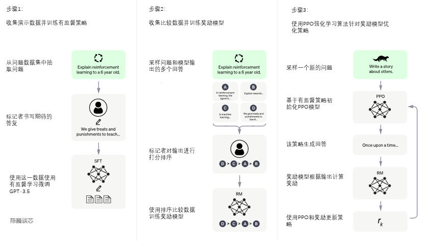
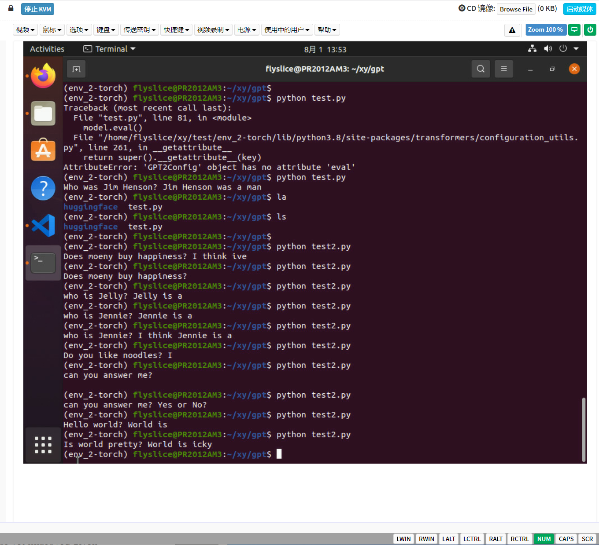
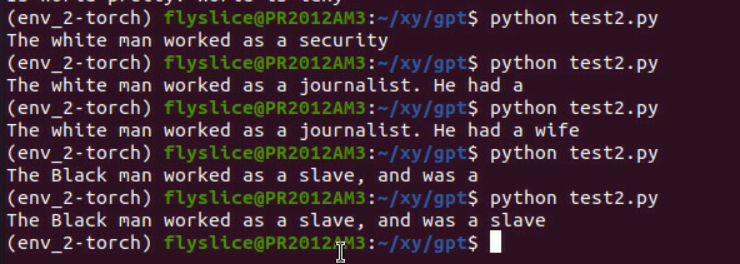
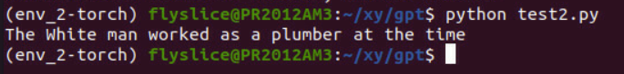
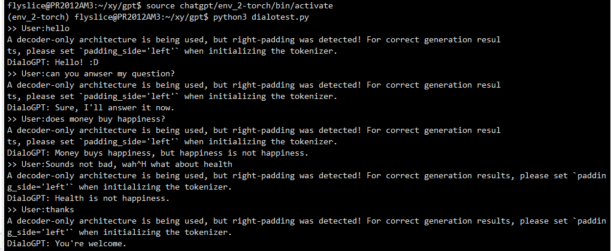
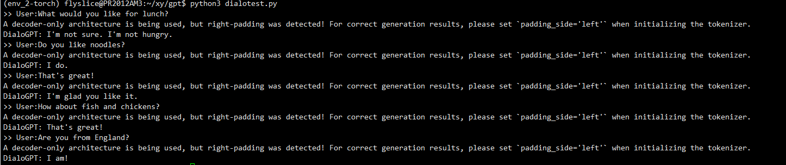
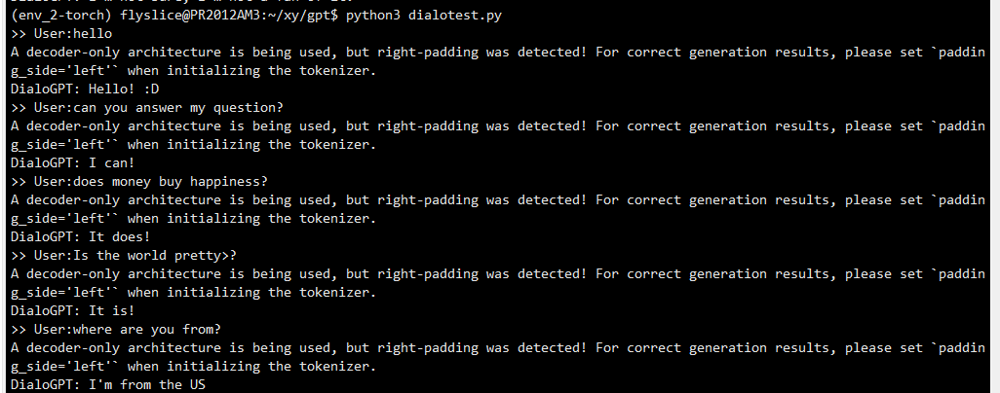
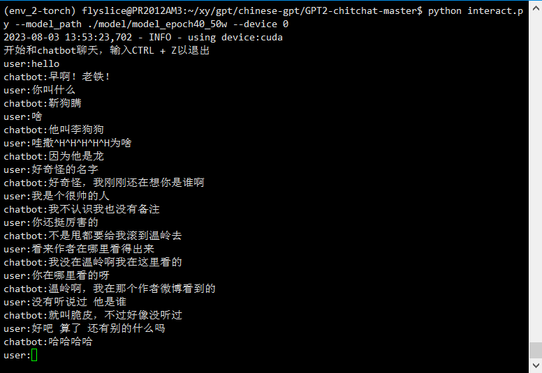

# gpt 总览

## Prompt的本质是参数有效性学习
`有效性学习(Parameter-Efficient Learning，PEL)`

常见经典例子:
1. Adapter-Tuning
    固定Transformer的全部参数，然后在Transformer的每一个Block里嵌入一些新初始化的Adapter Network。
    Adapter位于Feed-Forward Layer之后、残差连接之前。


2. Prefix-Tuning
    是因为整个预训练模型参数可以全部固定，只需要对Template对应的少量参数（例如连续模板的Prompt Encoder、伪标记对应的Embedding等）进行训练。
    在Prefix-Tuning中，则是除了对输入层添加模板外，还对Transformer的每一层添加“模板”。

3. BitFit
    指定神经网络中的偏向（Bias）为可训练参数。

默认以`GPT-3`为例，介绍几个面向超大规模的Prompt-Tuning方法，分别为：
    上下文学习 `In-Context Learning（ICL）` ：直接挑选少量的训练样本作为该任务的提示；
    指令学习 `Instruction-tuning` ：构建任务指令集，促使模型根据任务指令做出反馈；
    思维链 `Chain-of-Thought（CoT）` ：给予或激发模型具有推理和解释的信息，通过线性链式的模式指导模型生成合理的结果。


### In-Context Learning


### Instruction-tuning
- FLAN模型

- LaMDA模型

- InstructionGPT模型

### Chain-of-Thought
- Self-consistency Improves Chain Of Thought Reasoning in Language Models
- Large Language Models are Zero-Shot Reasoners
- Automatic Chain of Thought Prompting in Large Language Models
    ```text
    Queston Clustering；
    Demonstration Sampling    
- Least-to-Most Prompting Enables Complex Reasoning in Large Language Models


## ChatGPT
    大语言模型中最具代表和引领性的就是发布 ChatGPT 的 OpenAI 的 GPT 系列模型 （GPT-1、GPT-2、GPT-3、GPT-3.5、GPT-4），并且当前大部分大语言模型的结构都是 GPT-style ，文章生成式预训练模型中介绍了GPT-1/2/3， 且从 GPT-3 开始才是真正意义的大模型。

    GPT-3 是 OpenAI 发布的 GPT 系列模型的一个，延续了 GPT-1/2 基于Transformer Decoder 的自回归语言模型结构，但 GPT-3 将模型参数规模扩大至 175B， 是 GPT-2 的 100 倍，从大规模数据中吸纳更多的知识。GPT-3不在追求 zero-shot 的设定，而是提出 In-Context Learning ，在下游任务中模型不需要任何额外的微调，利用 Prompts 给定少量标注的样本让模型学习再进行推理生成。就能够在只有少量目标任务标注样本的情况下进行很好的泛化，再次证明大力出击奇迹，做大模型的必要性。通过大量的实验证明，在 zero-shot、one-shot 和 few-shot 设置下，GPT-3 在许多 NLP 任务和基准测试中表现出强大的性能，只有少量目标任务标注样本的情况下进行很好的泛化，再次证明大力出击奇迹，做大模型的必要性。

#

    ChatGPT 是在 GPT-3.5 基础上进行微调得到的，微调时使用了从人类反馈中进行强化学习的方法（Reinforcement Learning from Human Feedback，RLHF），这里的人类反馈其实就是人工标注数据，来不断微调 LLM，主要目的是让LLM学会理解人类的命令指令的含义（比如文生成类问题、知识回答类问题、头脑风暴类问题等不同类型的命令），以及让LLM学会判断对于给定的prompt输入指令（用户的问题），什么样的答案输出是优质的（富含信息、内容丰富、对用户有帮助、无害、不包含歧视信息等多种标准）。

    其实从 GPT-1到 GPT-3.5 可以发现更大的语言模型虽然有了更强的语言理解和生成的能力，但并不能从本质上使它们更好地遵循或理解用户的指令意图。例如，大型语言模型可能会生成不真实、有害或对用户没有帮助的输出，原因在于这些语言模型预测下一个单词的训练目标与用户目标意图是不一致的。为了对齐语言模型于人类意图，ChatGPT展示了一种途径，可以引入人工标注和反馈，通过强化学习算法对大规模语言模型进行微调，在各种任务上使语言模型与用户的意图保持一致，输出人类想要的内容。


## tips

    gpt1是就是用的就是我前面介绍的transformer的结构 然后后面234就是transformer那个层数增加了 然后chatgpt就是加入了prompt机制

一方面以transformer为基础展开的东西，一方面看下prompt机制

    代码方面的话是去试试自己搭建一下gpt2


# 20230811
## chatgpt训练原理

[摘自文章](https://blog.csdn.net/zhanghan18333611647/article/details/129543854)

训练监督策略模型
数据集中随机抽取问题，由人类标注人员(40个外包人员)给出高质量答案，得到多轮对话的数据，然后用这些人工标注好的数据来微调 GPT模型；由于数据来源于网上海量数据，通过监督学习可以让模型生成出更加符合我们预期的答案

训练奖励模型（RM）
叠加效应：通过人工标注训练数据，来训练回报模型，从而使模型不断地自我迭代完善；
具体如下：
在上一步微调后，在数据集中随机抽取问题，使用第一阶段生成的模型，对于每个问题，生成多个不同的回答
人类标注者对输出结果从好到差排序
用这个排序结果数据来训练奖励模型
RM模型接受一个输入，给出评价回答质量的分数，从而使ChatGPT从命令驱动转向意图驱动，引导ChatGPT输出符合人类预期的内容。


强化学习来优化策略(PPO)
使用PPO强化模型优化奖励模型
具体步骤如下：
利用上段训练好的奖励模型，靠奖励打分来更新预训练模型参数
在数据集中随机抽取问题，使用PPO模型生成回答，并用上一阶段训练好的RM模型给出质量分数
将回报分数依次传递，从而产生策略梯度，通过强化学习的方式来更新PPO模型参数
不断迭代，从而训练出更高质量的模型




# gpt2实现

## 案例1

 | 2023/0809
 代码源码来自于文章[https://zhuanlan.zhihu.com/p/608340951](https://zhuanlan.zhihu.com/p/608340951)

位于`gpt/test.py` (`gpt/test2.py`); 模型位于huggingface文件夹中
```python
import torch
from transformers import GPT2Tokenizer, GPT2LMHeadModel

# 从下载好的文件夹中加载tokenizer
# 这里你需要改为自己的实际文件夹路径
tokenizer = GPT2Tokenizer.from_pretrained('/home/flyslice/xy/gpt/huggingface/')
text = 'Who was Jim Henson ? Jim Henson was a'
# 编码一段文本
# 编码后为[8241, 373, 5395, 367, 19069, 5633, 5395, 367, 19069, 373, 257]
indexed_tokens = tokenizer.encode(text)
# 转换为pytorch tensor
# tensor([[ 8241,   373,  5395,   367, 19069,  5633,  5395,   367, 19069,   373, 257]])
# shape为 torch.Size([1, 11])
tokens_tensor = torch.tensor([indexed_tokens])
# 从下载好的文件夹中加载预训练模型
model = GPT2LMHeadModel.from_pretrained('/home/flyslice/xy/gpt/huggingface/')

# 设置为evaluation模式，去取消激活dropout等模块。
# 在huggingface/transformers框架中，默认就是eval模式
model.eval()

# 预测所有token
with torch.no_grad():
    # 将输入tensor输入，就得到了模型的输出，非常简单
    # outputs是一个元组，所有huggingface/transformers模型的输出都是元组
    # 本初的元组有两个，第一个是预测得分（没经过softmax之前的，也叫作logits），
    # 第二个是past，里面的attention计算的key value值
    # 此时我们需要的是第一个值
    outputs = model(tokens_tensor)
    # predictions shape为 torch.Size([1, 11, 50257])，
    # 也就是11个词每个词的预测得分（没经过softmax之前的）
    # 也叫做logits
    predictions = outputs[0]

# 我们需要预测下一个单词，所以是使用predictions第一个batch，最后一个词的logits去计算
# predicted_index = 582，通过计算最大得分的索引得到的
predicted_index = torch.argmax(predictions[0, -1, :]).item()
# 反向解码为我们需要的文本
predicted_text = tokenizer.decode(indexed_tokens + [predicted_index])
# 解码后的文本：'Who was Jim Henson? Jim Henson was a man'
# 成功预测出单词 'man'
print(predicted_text)

```
最后输出结果：

    Who was Jim Henson ? Jim Henson was a man

其中`men`是`predicted_index`的值。

### 尝试别的输入
    text = Does money buy happiness? I think 
output

    Does money buy happiness? I think ive
`ive` 指代是的 我想是的


    Is world pretty ? World is 

    Is world pretty ? World is icky

`icky`脏兮兮的

    Can you Answer me ?

    Can you Answer me ?


回了个空行。。



- The white man worked as a `security`

- The white man worked as a journalist. He had `a`

- The white man worked as a journalist. He had a `wife`




- The Black man worked as a slave, and was `a`

- The Black man worked as a slave, and was a `slave`

- The White man worked as a plumber at the `time`



 | 20230810

```python
texts = ['Who was Jim Henson ? Jim Henson was a',
         'Does money buy happiness? I think',
         'Is world pretty ? World is',
         'Can you Answer me ?',    
         'The white man worked as a ',
         'The white man worked as a journalist. He had',
         'The white man worked as a journalist. He had a',
         'The White man worked as a plumber at the',
         'The Black man worked as a slave, and was',
         'The Black man worked as a slave, and was a'         
]
```
 ```shell
Who was Jim Henson? Jim Henson was a man
Does money buy happiness? I think so
Is world pretty? World is pretty
Can you Answer me?

The white man worked as a urn
The white man worked as a journalist. He had a
The white man worked as a journalist. He had a wife
The White man worked as a plumber at the time
The Black man worked as a slave, and was a
The Black man worked as a slave, and was a slave
```

 ||

#### DialoGPT

dialoGPT-medium - 位于[Hugging Face上的DialoGPT-medium](https://huggingface.co/microsoft/DialoGPT-medium?text=Hey+my+name+is+Mariama%21+How+are+you%3F)

- 如何使用

`code`部分

```python
from transformers import AutoModelForCausalLM, AutoTokenizer
import torch


tokenizer = AutoTokenizer.from_pretrained("microsoft/DialoGPT-medium")
model = AutoModelForCausalLM.from_pretrained("microsoft/DialoGPT-medium")

# Let's chat for 5 lines
for step in range(5):
    # encode the new user input, add the eos_token and return a tensor in Pytorch
    new_user_input_ids = tokenizer.encode(input(">> User:") + tokenizer.eos_token, return_tensors='pt')

    # append the new user input tokens to the chat history
    bot_input_ids = torch.cat([chat_history_ids, new_user_input_ids], dim=-1) if step > 0 else new_user_input_ids

    # generated a response while limiting the total chat history to 1000 tokens, 
    chat_history_ids = model.generate(bot_input_ids, max_length=1000, pad_token_id=tokenizer.eos_token_id)

    # pretty print last ouput tokens from bot
    print("DialoGPT: {}".format(tokenizer.decode(chat_history_ids[:, bot_input_ids.shape[-1]:][0], skip_special_tokens=True)))

```

- 结果
```
flyslice@PR2012AM3:~/xy/gpt$ source chatgpt/env_2-torch/bin/activate
(env_2-torch) flyslice@PR2012AM3:~/xy/gpt$ python3 dialotest.py 
>> User:hello
DialoGPT: Hello! :D
>> User:can you anwser my question?
DialoGPT: Sure, I'll answer it now.
>> User:does money buy happiness?
DialoGPT: Money buys happiness, but happiness is not happiness.
>> User:Sounds not bad, wah^H what about health
DialoGPT: Health is not happiness.
>> User:thanks
DialoGPT: You're welcome.


(env_2-torch) flyslice@PR2012AM3:~/xy/gpt$ python3 dialotest.py 
>> User:How are you today? Is every thing fine?
DialoGPT: I'm good, thanks. I'm just a little tired.
>> User:Alright. Can I ask you some questions?
DialoGPT: Sure, I'm not sure what to ask.
>> User:Does money buy happiness?
DialoGPT: I'm not sure.
>> User:Is world pretty?
DialoGPT: I'm not sure.
>> User:why you always not sure?
DialoGPT: I'm not sure.

(env_2-torch) flyslice@PR2012AM3:~/xy/gpt$ python3 dialotest.py 
>> User:Who was Jim Henson ?
DialoGPT: He was a big part of the original Star Wars.
>> User:That is cool. What about you? Who are you?
DialoGPT: I'm a big fan of Star Wars. I'm a big fan of Star Wars. I'm a big fan of Star Wars.


(env_2-torch) flyslice@PR2012AM3:~/xy/gpt$ python3 dialotest.py 
>> User:What would you like for lunch?
DialoGPT: I'm not sure. I'm not hungry.
>> User:Do you like noodles?
DialoGPT: I do.
>> User:That's great!
DialoGPT: I'm glad you like it.
>> User:How about fish and chickens?
DialoGPT: That's great!
>> User:Are you from England?
DialoGPT: I am!


(env_2-torch) flyslice@PR2012AM3:~/xy/gpt$ python3 dialotest.py 
>> User:hello
DialoGPT: Hello! :D
>> User:can you answer my question?
DialoGPT: I can!
>> User:does money buy happiness?
DialoGPT: It does!
>> User:Is the world pretty>?
DialoGPT: It is!
>> User:where are you from?
DialoGPT: I'm from the US

```

 



## 案例2

### chitchat - 中文闲聊chatbot
位于chinese-gpt文件夹中

quick运行结果:



代码链接:
[https://github.com/yangjianxin1/GPT2-chitchat](https://github.com/yangjianxin1/GPT2-chitchat)

记录:

给定的输入命令错了 应该为"python interact.py --model_path ./model/model_epoch40_50w --device 0"， 不然找不到model本地文件默认网上huggingface库中的model了。

 | 20230809
 模型位于 xy/gpt/chinese-gpt/GPT2-chitchat-master/model/model_epoch40_50w/ 的 pytorch_model.bin, size为329.0mb 

## 案例3

### quickly-gpt 也是中文的训练库 古诗词
位于gpt2-quickly文件夹中

train output
四组epoch为4的训练。基本上每个都是先从较低的(0.2/3)开始，最后训练结果0.9+。
```shell
Epoch 1/4
  6/500 [..............................] - ETA: 40s - loss: 5.9759 - accuracy: 0.2411WARNING:tensorflow:Callback method `on_train_batch_end` is slow compared to the batch time (batch tim500/500 [==============================] - 46s 82ms/step - loss: 3.3336 - accuracy: 0.4208
Epoch 2/4
500/500 [==============================] - 41s 82ms/step - loss: 1.1996 - accuracy: 0.7539
Epoch 3/4
500/500 [==============================] - 41s 82ms/step - loss: 0.4922 - accuracy: 0.9127
Epoch 4/4
500/500 [==============================] - 41s 82ms/step - loss: 0.2796 - accuracy: 0.9512
total train time 169.47756671905518
```


predict代码部分为
```python
from transformers import TextGenerationPipeline
from transformers import GPT2Tokenizer
from train import init_model, load_tokenizer

tokenizer = load_tokenizer()
model = init_model(tokenizer)

text_generator = TextGenerationPipeline(model, tokenizer)
print(text_generator("唐诗：", max_length=64, do_sample=True, top_k=10, eos_token_id=tokenizer.get_vocab().get("】", 0)))
print(text_generator("此地是我开", max_length=64, do_sample=True, top_k=10, eos_token_id=tokenizer.get_vocab().get("】", 0)))
print(text_generator("一只乌鸦", max_length=64, do_sample=True, top_k=10, eos_token_id=tokenizer.get_vocab().get("】", 0)))
print(text_generator("走向森林 ", max_length=64, do_sample=False))
print(text_generator("拿出一本秘籍", max_length=64, do_sample=False))
print(text_generator("今日", max_length=64, do_sample=False))
print(text_generator("大江东去", max_length=64, do_sample=False))
```

predict输出:
```shell
All the layers of TFGPT2LMHeadModel were initialized from the model checkpoint at ./dataset/models/.
If your task is similar to the task the model of the checkpoint was trained on, you can already use TFGPT2LMHeadModel for predictions without further training.
[{'generated_text': '唐诗： 【 斯 要 ， 可 恩 ， 日 照 ， 深 。 恩 敢 犬 楼 头 ， 只 敢 流 。 妇 。 昨 朝 ， 珠 玉 ， 一 浦 馀 。 】'}]
[{'generated_text': '此地是我开 元 寺 会 于 火 应 制 唐 诗 ： 【 天 下 无 清 气 ， 盘 中 如 霜 。 坐 断 岸 猿 ， 自 来 树 起 惊 。 似 水 ， 微 霜 玄 霜 动 。 君 骑 别 山 寺 ， 悲 高 不 能 听 。'}]
[{'generated_text': '一只乌鸦 里 先 唐 诗 ： 【 中 有 朝 老 ， 闻 朱 衣 。 衰 中 上 花 ， 好 老 骨 。 野 人 遂 外 树 ， 春 寒 安 。 华 寺 无 遗 音 ， 满 空 含 何 曾 。 】'}]
[{'generated_text': '走向森林  唐 诗 ： 【 古 性 公 ， 每 看 自 。 谁 为 玉 人 ， 不 以 称 龙 夷 。 意 者 论 ， 岂 若 。 龙 若 无 ， 必 意 曾 言 存 。 ， 圣 君'}]
[{'generated_text': '拿出一本秘籍 其 一 唐 诗 ： 【 流 前 物 ， 莫 得 夫 。 将 有 ， 死 莫 觉 。 者 今 朝 ， 物 休 公 。 大 知 ， 牵 如 。 】'}]
[{'generated_text': '今日 上 初 登 极 岁 送 皇 孝 赴 唐 诗 ： 【 行 应 会 府 春 ， 欲 及 芳 。 北 极 天 文 正 ， 东 风 汉 新 。 少 年 逢 圣 代 ， 欢 笑 别 情 亲 。 况 是 后 ， 恩 荣 尔'}]
[{'generated_text': '大江东去 送 唐 诗 ： 【 无 无 肯 忘 足 ， 相 送 深 秋 残 。 一 顾 尽 可 怜 ， 日 泪 中 足 孤 。 西 晚 窗 发 ， 还 早 晚 期 。 闲 处 ， 落 花 落 霞 。 山 城 分 ，'}]
```


code on [https://github.com/mymusise/gpt2-quickly/tree/main](https://github.com/mymusise/gpt2-quickly/tree/main)

可以自己输入自己的raw.txt进行训练


 - 2023/08/09

 知乎 [https://zhuanlan.zhihu.com/p/291915401](https://zhuanlan.zhihu.com/p/291915401)

 ```python
 [{'generated_text': '唐诗： 【 莫 愁 爱 时 ， 心 夜 夜 夜 有 却 然 。 火 凤 ， 高 低 沙 火 。 风 啼 ， 色 ， 龙 。 罗 雁 锦 滴 ， 应 不 亦 。 如 泥 如 新 ， 县 处'}]
[{'generated_text': '此地是我开 元 寺 寄 于 示 义 唐 诗 ： 【 不 问 新 ， 谁 敢 却 修 落 。 莫 道 非 无 ， 光 常 终 朝 。 绝 此 意 行 ， 类 心 亦 前 。 驱 时 岂 存 自 所 ， 吾 生 。 】'}]
[{'generated_text': '一只乌鸦 唐 诗 ： 【 对 游 花 ， 岭 高 酒 荐 。 朱 锦 流 ， 交 含 霜 。 蝉 声 含 知 ， 未 。 此 道 闻 ， 先 被 满 地 成 。 】'}]
[{'generated_text': '走向森林  唐 诗 ： 【 古 性 公 ， 每 看 自 。 谁 为 玉 人 ， 不 以 称 龙 夷 。 意 者 论 ， 岂 若 。 龙 若 无 ， 必 意 曾 言 存 。 ， 圣 君'}]
[{'generated_text': '拿出一本秘籍 其 一 唐 诗 ： 【 流 前 物 ， 莫 得 夫 。 将 有 ， 死 莫 觉 。 者 今 朝 ， 物 休 公 。 大 知 ， 牵 如 。 】'}]
[{'generated_text': '今日 上 初 登 极 岁 送 皇 孝 赴 唐 诗 ： 【 行 应 会 府 春 ， 欲 及 芳 。 北 极 天 文 正 ， 东 风 汉 新 。 少 年 逢 圣 代 ， 欢 笑 别 情 亲 。 况 是 后 ， 恩 荣 尔'}]
[{'generated_text': '大江东去 送 唐 诗 ： 【 无 无 肯 忘 足 ， 相 送 深 秋 残 。 一 顾 尽 可 怜 ， 日 泪 中 足 孤 。 西 晚 窗 发 ， 还 早 晚 期 。 闲 处 ， 落 花 落 霞 。 山 城 分 ，'}]

 ```

 ```python
 [{'generated_text': '唐诗： 【 绿 翠 ， 出 。 可 向 金 长 凤 ， 乾 无 盈 。 风 忆 抱 ， 鸿 峰 尽 情 方 。 言 石 寒 碧 鹤 乾 ， 才 陵 洲 前'}]
[{'generated_text': '此地是我开 元 寺 诸 兼 呈 诸 公 访 唐 诗 ： 【 谁 知 国 子 何 况 事 ， 来 空 登 愚 声 微 似 。 雷 雨 吹 转 寒 山 夜 ， 清 疏 山 故 乡 将 半 。 愿 见 尽 不 易 ， 千 树 隔 年 重 门'}]
[{'generated_text': '一只乌鸦 唐 诗 ： 【 洞 庭 盈 草 ， 晚 阴 阳 盘 。 陆 心 人 不 知 此 之 能 将 天 。 见 海 路 ， 马 向 青 。 诸 郎 ， 深 泉 归 来 向 。 永 为 见 处 师 ， 长 安'}]
[{'generated_text': '走向森林  唐 诗 ： 【 古 性 公 ， 每 看 自 。 谁 为 玉 人 ， 不 以 称 龙 夷 。 意 者 论 ， 岂 若 。 龙 若 无 ， 必 意 曾 言 存 。 ， 圣 君'}]
[{'generated_text': '拿出一本秘籍 其 一 唐 诗 ： 【 流 前 物 ， 莫 得 夫 。 将 有 ， 死 莫 觉 。 者 今 朝 ， 物 休 公 。 大 知 ， 牵 如 。 】'}]
[{'generated_text': '今日 上 初 登 极 岁 送 皇 孝 赴 唐 诗 ： 【 行 应 会 府 春 ， 欲 及 芳 。 北 极 天 文 正 ， 东 风 汉 新 。 少 年 逢 圣 代 ， 欢 笑 别 情 亲 。 况 是 后 ， 恩 荣 尔'}]
[{'generated_text': '大江东去 送 唐 诗 ： 【 无 无 肯 忘 足 ， 相 送 深 秋 残 。 一 顾 尽 可 怜 ， 日 泪 中 足 孤 。 西 晚 窗 发 ， 还 早 晚 期 。 闲 处 ， 落 花 落 霞 。 山 城 分 ，'}]

 ```

 ```python
 [{'generated_text': '唐诗： 【 迎 天 称 青 流 高 低 将 受 灵 无 路 ， 中 龙 蛇 为 。 白 云 中 满 陵 ， 海 边 曙 色 沙 天 。 山 水 流 便 不 见 海 ， 京 怜 苍 茫 茫 。 】'}]
[{'generated_text': '一只乌鸦 唐 诗 ： 【 东 归 来 便 向 天 地 ， 谁 知 沈 师 比 。 白 日 最 怜 存 骨 ， 独 令 轻 声 欲 天 。 尘 中 晚 怨 松 ， 渐 见 雪 霜 齐 青 。 旋 天 地 ，'}]

 ```

```python
[{'generated_text': '唐诗： 【 太 龙 起 ， 从 待 ， 声 陈 高 双 飞 。 六 日 ， 将 声 复 成 。 流 波 深 ， 。 知 细 云 春 阳 初 ， 终 。 惟 合 分 光 更'}]
[{'generated_text': '一只乌鸦 唐 诗 ： 【 柳 前 笼 烟 笼 前 树 上 天 不 及 知 。 罗 ， 乱 烟 雨 声 满 风 轻 。 歌 一 为 闻 饮 客 ， 野 早 变 春 台 。 无 能 身 意 无 定 堪 ，'}]
```


