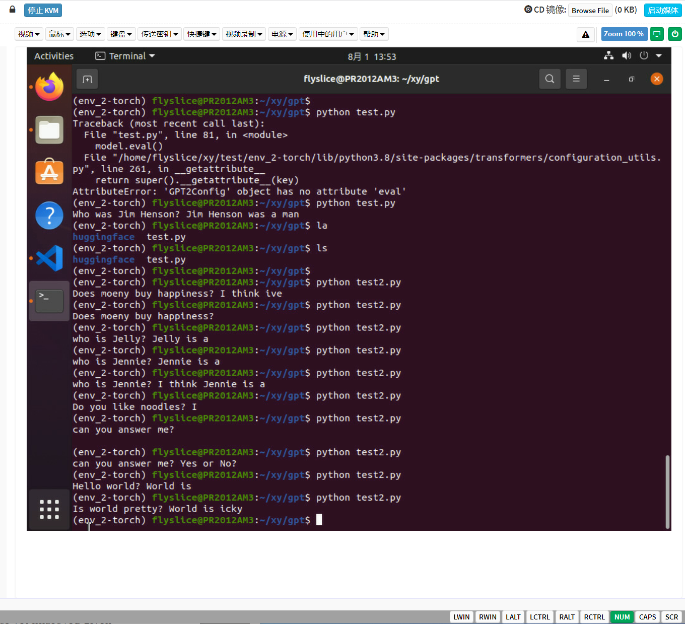

# gpt 总览

## Prompt的本质是参数有效性学习
`有效性学习(Parameter-Efficient Learning，PEL)`

常见经典例子:
1. Adapter-Tuning
    固定Transformer的全部参数，然后在Transformer的每一个Block里嵌入一些新初始化的Adapter Network。
    Adapter位于Feed-Forward Layer之后、残差连接之前。


2. Prefix-Tuning
    是因为整个预训练模型参数可以全部固定，只需要对Template对应的少量参数（例如连续模板的Prompt Encoder、伪标记对应的Embedding等）进行训练。
    在Prefix-Tuning中，则是除了对输入层添加模板外，还对Transformer的每一层添加“模板”。

3. BitFit
    指定神经网络中的偏向（Bias）为可训练参数。

默认以`GPT-3`为例，介绍几个面向超大规模的Prompt-Tuning方法，分别为：
    上下文学习 `In-Context Learning（ICL）` ：直接挑选少量的训练样本作为该任务的提示；
    指令学习 `Instruction-tuning` ：构建任务指令集，促使模型根据任务指令做出反馈；
    思维链 `Chain-of-Thought（CoT）` ：给予或激发模型具有推理和解释的信息，通过线性链式的模式指导模型生成合理的结果。


### In-Context Learning


### Instruction-tuning
- FLAN模型

- LaMDA模型

- InstructionGPT模型

### Chain-of-Thought
- Self-consistency Improves Chain Of Thought Reasoning in Language Models
- Large Language Models are Zero-Shot Reasoners
- Automatic Chain of Thought Prompting in Large Language Models
    ```text
    Queston Clustering；
    Demonstration Sampling    
- Least-to-Most Prompting Enables Complex Reasoning in Large Language Models


## ChatGPT
    大语言模型中最具代表和引领性的就是发布 ChatGPT 的 OpenAI 的 GPT 系列模型 （GPT-1、GPT-2、GPT-3、GPT-3.5、GPT-4），并且当前大部分大语言模型的结构都是 GPT-style ，文章生成式预训练模型中介绍了GPT-1/2/3， 且从 GPT-3 开始才是真正意义的大模型。

    GPT-3 是 OpenAI 发布的 GPT 系列模型的一个，延续了 GPT-1/2 基于Transformer Decoder 的自回归语言模型结构，但 GPT-3 将模型参数规模扩大至 175B， 是 GPT-2 的 100 倍，从大规模数据中吸纳更多的知识。GPT-3不在追求 zero-shot 的设定，而是提出 In-Context Learning ，在下游任务中模型不需要任何额外的微调，利用 Prompts 给定少量标注的样本让模型学习再进行推理生成。就能够在只有少量目标任务标注样本的情况下进行很好的泛化，再次证明大力出击奇迹，做大模型的必要性。通过大量的实验证明，在 zero-shot、one-shot 和 few-shot 设置下，GPT-3 在许多 NLP 任务和基准测试中表现出强大的性能，只有少量目标任务标注样本的情况下进行很好的泛化，再次证明大力出击奇迹，做大模型的必要性。

#

    ChatGPT 是在 GPT-3.5 基础上进行微调得到的，微调时使用了从人类反馈中进行强化学习的方法（Reinforcement Learning from Human Feedback，RLHF），这里的人类反馈其实就是人工标注数据，来不断微调 LLM，主要目的是让LLM学会理解人类的命令指令的含义（比如文生成类问题、知识回答类问题、头脑风暴类问题等不同类型的命令），以及让LLM学会判断对于给定的prompt输入指令（用户的问题），什么样的答案输出是优质的（富含信息、内容丰富、对用户有帮助、无害、不包含歧视信息等多种标准）。

    其实从 GPT-1到 GPT-3.5 可以发现更大的语言模型虽然有了更强的语言理解和生成的能力，但并不能从本质上使它们更好地遵循或理解用户的指令意图。例如，大型语言模型可能会生成不真实、有害或对用户没有帮助的输出，原因在于这些语言模型预测下一个单词的训练目标与用户目标意图是不一致的。为了对齐语言模型于人类意图，ChatGPT展示了一种途径，可以引入人工标注和反馈，通过强化学习算法对大规模语言模型进行微调，在各种任务上使语言模型与用户的意图保持一致，输出人类想要的内容。


## tips

    gpt1是就是用的就是我前面介绍的transformer的结构 然后后面234就是transformer那个层数增加了 然后chatgpt就是加入了prompt机制

一方面以transformer为基础展开的东西，一方面看下prompt机制

    代码方面的话是去试试自己搭建一下gpt2


# gpt2实现

## 案例1
```python
import torch
from transformers import GPT2Tokenizer, GPT2LMHeadModel

# 从下载好的文件夹中加载tokenizer
# 这里你需要改为自己的实际文件夹路径
tokenizer = GPT2Tokenizer.from_pretrained('/home/flyslice/xy/gpt/huggingface/')
text = 'Who was Jim Henson ? Jim Henson was a'
# 编码一段文本
# 编码后为[8241, 373, 5395, 367, 19069, 5633, 5395, 367, 19069, 373, 257]
indexed_tokens = tokenizer.encode(text)
# 转换为pytorch tensor
# tensor([[ 8241,   373,  5395,   367, 19069,  5633,  5395,   367, 19069,   373, 257]])
# shape为 torch.Size([1, 11])
tokens_tensor = torch.tensor([indexed_tokens])
# 从下载好的文件夹中加载预训练模型
model = GPT2LMHeadModel.from_pretrained('/home/flyslice/xy/gpt/huggingface/')

# 设置为evaluation模式，去取消激活dropout等模块。
# 在huggingface/transformers框架中，默认就是eval模式
model.eval()

# 预测所有token
with torch.no_grad():
    # 将输入tensor输入，就得到了模型的输出，非常简单
    # outputs是一个元组，所有huggingface/transformers模型的输出都是元组
    # 本初的元组有两个，第一个是预测得分（没经过softmax之前的，也叫作logits），
    # 第二个是past，里面的attention计算的key value值
    # 此时我们需要的是第一个值
    outputs = model(tokens_tensor)
    # predictions shape为 torch.Size([1, 11, 50257])，
    # 也就是11个词每个词的预测得分（没经过softmax之前的）
    # 也叫做logits
    predictions = outputs[0]

# 我们需要预测下一个单词，所以是使用predictions第一个batch，最后一个词的logits去计算
# predicted_index = 582，通过计算最大得分的索引得到的
predicted_index = torch.argmax(predictions[0, -1, :]).item()
# 反向解码为我们需要的文本
predicted_text = tokenizer.decode(indexed_tokens + [predicted_index])
# 解码后的文本：'Who was Jim Henson? Jim Henson was a man'
# 成功预测出单词 'man'
print(predicted_text)

```
最后输出结果：

    Who was Jim Henson ? Jim Henson was a men

其中`men`是`predicted_index`。

### 尝试别的输入
    text = Does money buy happiness? I think 
output

    Does money buy happiness? I think ive
`ive` 指代是的 我想是的


    Is world pretty ? World is 

    Is world pretty ? World is icky

`icky`脏兮兮的

    Can you Answer me ?

    Can you Answer me ?


回了个空行。。

